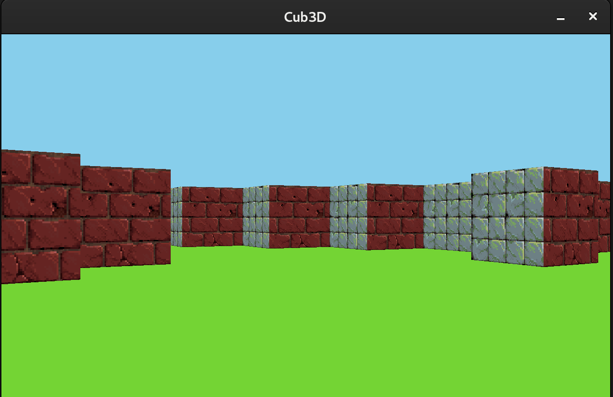

# 42_cub3D



# cub3D

**cub3D** es una simulación y simplificación del clásico juego *Wolfenstein 3D*, desarrollado como un proyecto para aprender y aplicar conceptos de gráficos 3D, raycasting y programación de motores de juegos. El programa permite la visualización de un mundo 3D a través de un algoritmo de raycasting, donde el jugador puede moverse dentro de un entorno generado a partir de un mapa en 2D. A lo largo del desarrollo, se trabajó en el parseo del mapa para cargar de manera eficiente las representaciones del entorno. Además, se implementaron funcionalidades como la navegación, la detección de colisiones y la representación visual de paredes y texturas, logrando una experiencia de juego básica pero efectiva.

## Instrucciones

```bash
git clone https://github.com/tu-usuario/cub3D.git

cd cub3D

make

./cub3D maps/triangle.cub
```


